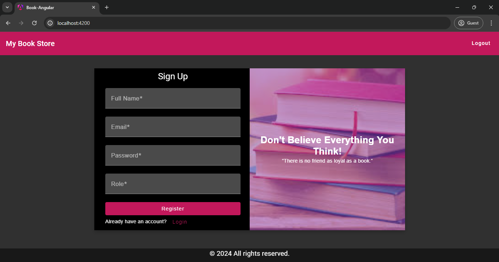
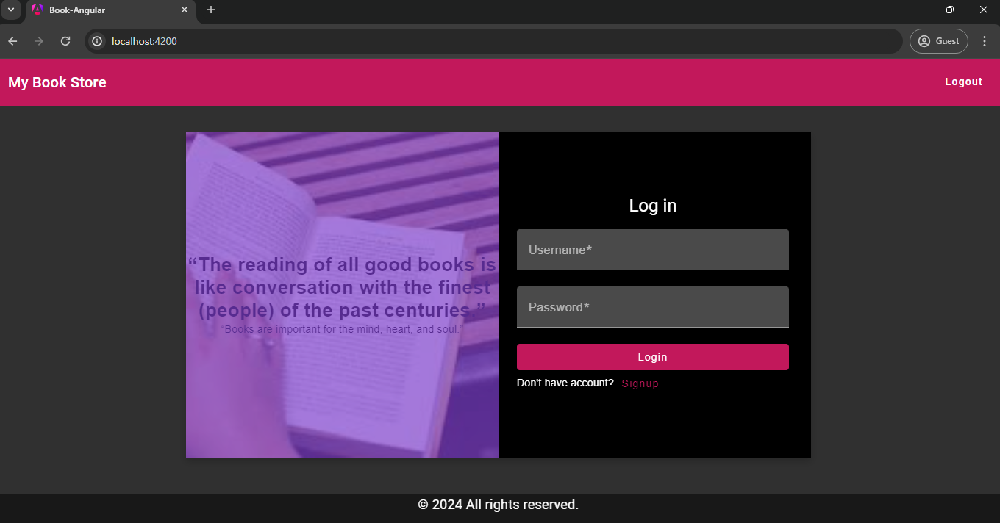
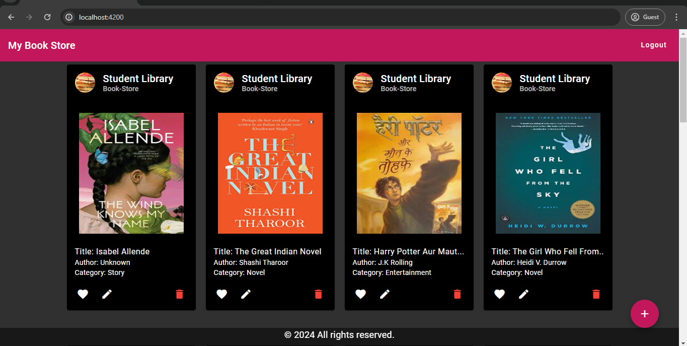
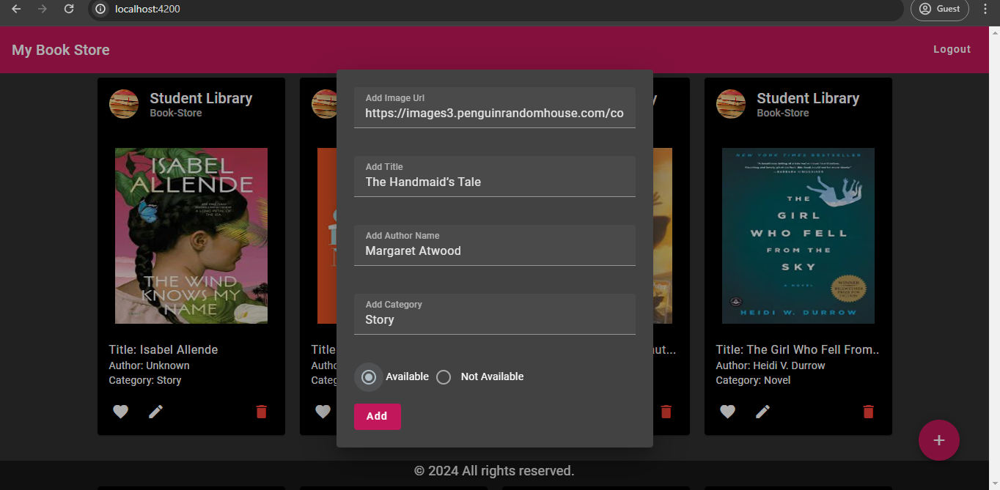
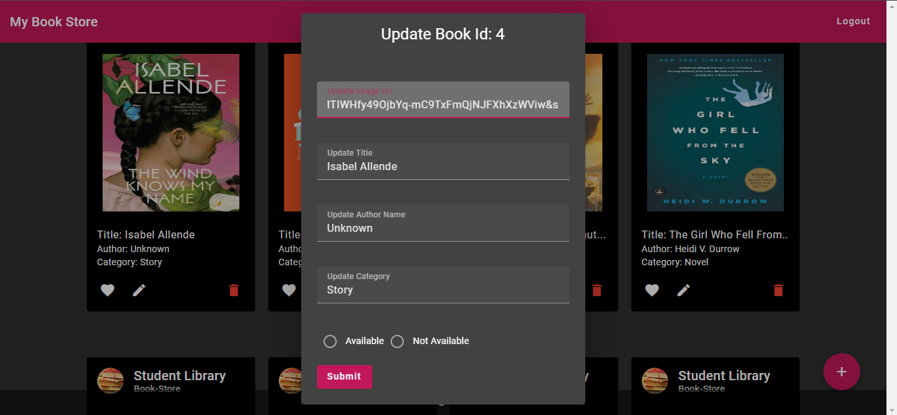
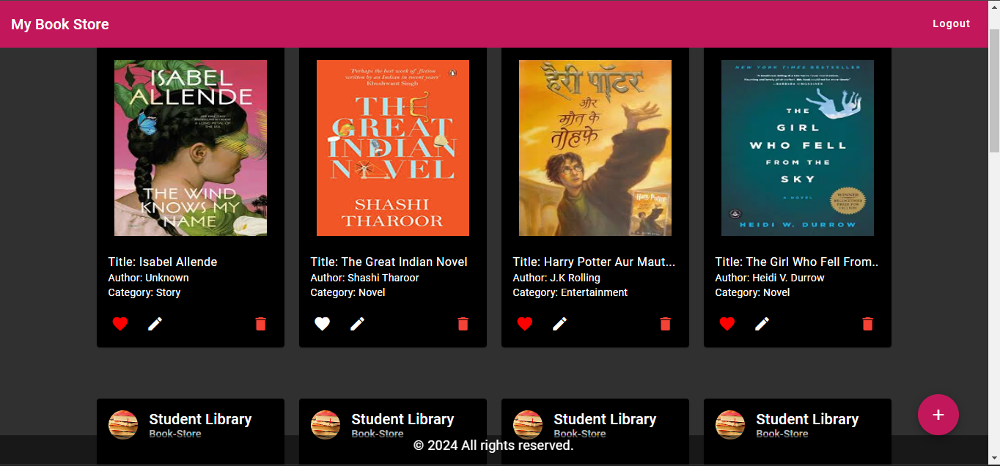

# 📚 Book-Store Management System  📚

Welcome to the Bookstore Management System! This project showcases a bookstore application built using Spring Boot for the backend and Angular 17 for the frontend.

## 📋 Functionalities

### Backend Functionalities:

#### 🔐 Authentication Service
- **JWT Token Generation:** Generate a JWT token upon successful user authentication.
- **Token Validation:** Validate JWT token for secure access to other backend services.

#### 👤 User Service
- **User Registration:** Register users with the bookstore system.
- **User Login:** Authenticate users to access the system.

#### 📚 Book Service
- **Add Book:** Add new books to the bookstore inventory.
- **Edit Book:** Modify existing book details.
- **Delete Book:** Remove books from the inventory.

### Frontend Functionalities:

- **User Registration:** Users can register for a new account through the frontend.
- **User Login:** Users can log in to their accounts securely.
- **Add Book:** Add new books to the bookstore inventory through a user-friendly interface.
- **Edit Book:** Modify existing book details with ease.
- **Delete Book:** Remove books from the inventory effortlessly.

## 🚀 Getting Started

To get started with the Bookstore Management System, follow these steps:

1. Clone the repository to your local machine.
2. Set up and configure the backend services (Authentication Service, User Service, Book Service) using Spring Boot.
3. Set up and configure the frontend using Angular 17.
4. Start the backend services.
5. Launch the frontend application.
6. Explore the user interface to perform various actions such as user registration, login, adding, editing, and deleting books.

## 📸 Screenshots

### 1. Register Page

This screenshot shows the user registration page where new users can sign up for an account in the bookstore system.

### 2. Login Page

Users can log in to their accounts using this page, providing their credentials to access the system.

### 3. List of Books

Here, you can see the list of available books in the bookstore inventory, displayed for users to browse and select.

### 4. Add New Book Form

This screenshot displays the form for adding a new book to the inventory, allowing users to input details such as title, author, and price.

### 5. Update Book Details Page

Users can update existing book details using this page, which provides fields for editing the book's title, author, price, and other attributes.

### 6. Like Button

The like button allows users to express their appreciation for a particular book by clicking on it, adding it to their favorites or increasing its popularity.

## 🤝 Contribution

Contributions to this project are welcome! Feel free to open issues, submit pull requests, or provide feedback to enhance the functionality and usability of this bookstore application.

Let's build a comprehensive and user-friendly bookstore system together using Spring Boot and Angular!

Happy Bookstore Management! 📚🏪

## 📞 Contact Information

If you have any questions, feedback, or need assistance with this project, please feel free to reach out:

